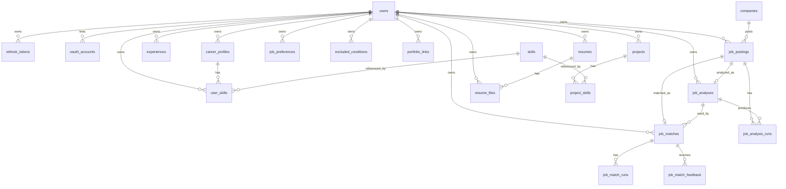

# ERD

```mermaid
erDiagram
    users ||--o{ refresh_tokens : owns
    users ||--o{ oauth_accounts : links
    users ||--o{ career_profiles : owns
    users ||--o{ user_skills : owns
    users ||--o{ experiences : owns
    users ||--o{ projects : owns
    users ||--o{ job_preferences : owns
    users ||--o{ excluded_conditions : owns
    users ||--o{ portfolio_links : owns
    users ||--o{ job_postings : owns
    users ||--o{ job_analyses : owns
    users ||--o{ job_matches : owns
    users ||--o{ resumes : owns
    users ||--o{ resume_files : owns

    career_profiles ||--o{ user_skills : has
    skills ||--o{ user_skills : referenced_by
    projects ||--o{ project_skills : has
    skills ||--o{ project_skills : referenced_by

    companies ||--o{ job_postings : posts
    job_postings ||--o| job_analyses : analyzed_as
    job_postings ||--o{ job_analysis_runs : has
    job_postings ||--o| job_matches : matched_as
    job_analyses ||--o{ job_analysis_runs : produces
    job_analyses ||--o{ job_matches : used_by
    job_matches ||--o{ job_match_runs : has
    job_matches ||--o{ job_match_feedback : receives

    resumes ||--o{ resume_files : has
```

## v0.3.0 추가 관계

- `users` 1:N `resumes`
- `resumes` 1:N `resume_files`
- `users` 1:N `resume_files`

`resume_files.user_id`는 조회 성능과 소유권 검사를 위해 중복 저장한다.
