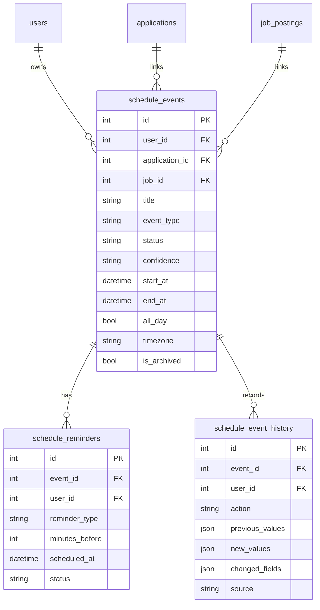

# ERD

## v0.4.1 Schedule ERD

```mermaid
erDiagram
    users ||--o{ schedule_events : owns
    applications ||--o{ schedule_events : links
    job_postings ||--o{ schedule_events : links
    schedule_events ||--o{ schedule_reminders : has
    schedule_events ||--o{ schedule_event_history : records

    schedule_events {
      int id PK
      int user_id FK
      int application_id FK
      int job_id FK
      string title
      string event_type
      string status
      string confidence
      datetime start_at
      datetime end_at
      bool all_day
      string timezone
      bool is_archived
    }

    schedule_reminders {
      int id PK
      int event_id FK
      int user_id FK
      string reminder_type
      int minutes_before
      datetime scheduled_at
      string status
    }

    schedule_event_history {
      int id PK
      int event_id FK
      int user_id FK
      string action
      json previous_values
      json new_values
      json changed_fields
      string source
    }
```
