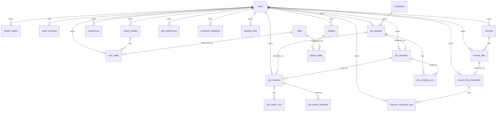

# ERD



## v0.3.0 추가 관계

- `users` 1:N `resumes`
- `resumes` 1:N `resume_files`
- `users` 1:N `resume_files`

`resume_files.user_id`는 조회 성능과 소유권 검사를 위해 중복 저장한다.

## v0.3.1 추가 관계

- `resume_file_extractions`는 파일별 최신 텍스트 추출 결과와 사용자 수정본을 저장한다.
- `resume_extraction_runs`는 최초 추출과 재추출 실행 이력을 모두 보존한다.
- 모든 이력서 추출 관련 테이블은 `user_id`를 저장하여 사용자 소유권 검사를 명시적으로 수행한다.

## v0.3.2 추가 관계

```text
resumes 1 ─ N resume_analyses
resume_files 1 ─ 1 resume_analyses
resume_file_extractions 1 ─ N resume_analyses
resume_analyses 1 ─ N resume_analysis_runs
users 1 ─ N resume_analyses
users 1 ─ N resume_analysis_runs
```

`resume_analyses`는 파일별 최신 분석 결과 1건을 나타내며, 모든 분석 시도는 `resume_analysis_runs`에 누적한다.
