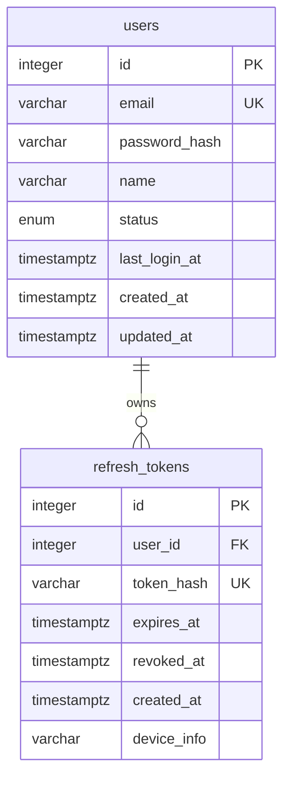

# ApplyMate AI ERD

## v0.1.1

```mermaid
erDiagram
  users ||--o{ refresh_tokens : owns

  users {
    integer id PK
    varchar email UK
    varchar password_hash
    varchar name
    enum status
    timestamptz last_login_at
    timestamptz created_at
    timestamptz updated_at
  }

  refresh_tokens {
    integer id PK
    integer user_id FK
    varchar token_hash UK
    timestamptz expires_at
    timestamptz revoked_at
    timestamptz created_at
    varchar device_info
  }
```
