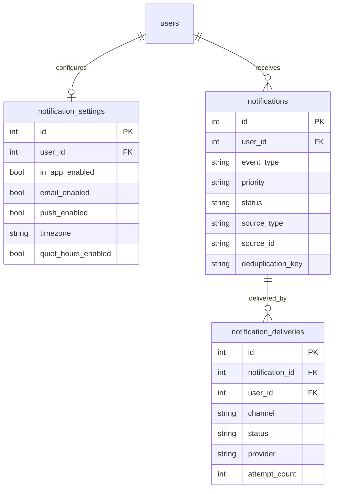
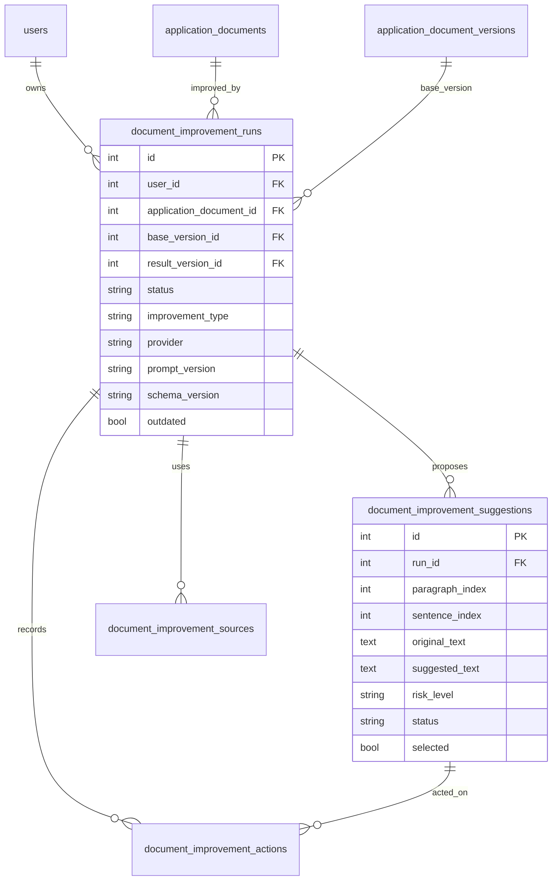
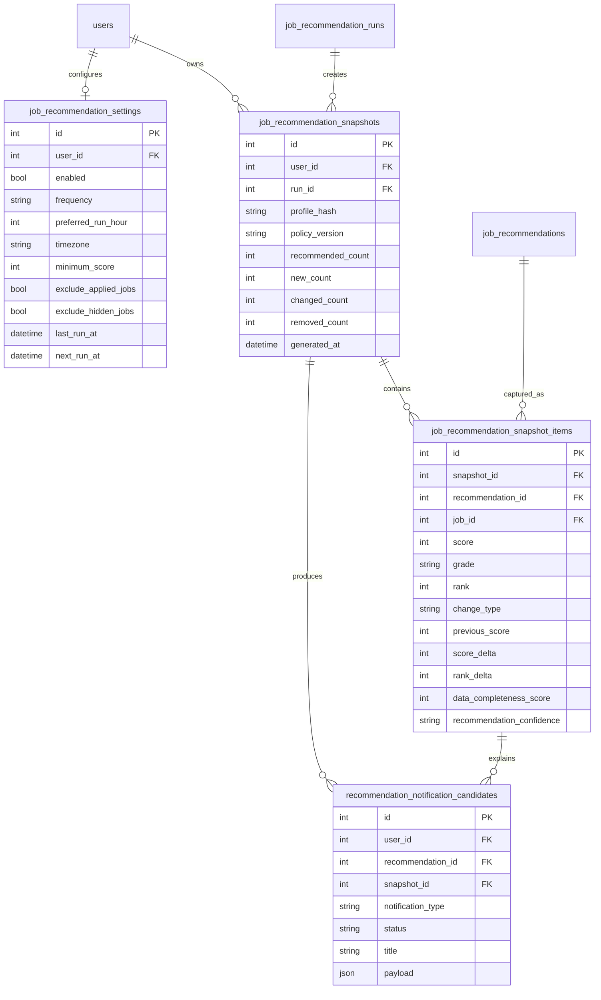
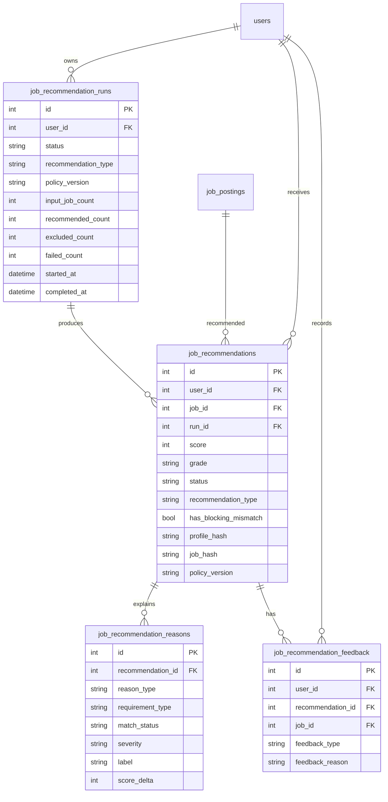
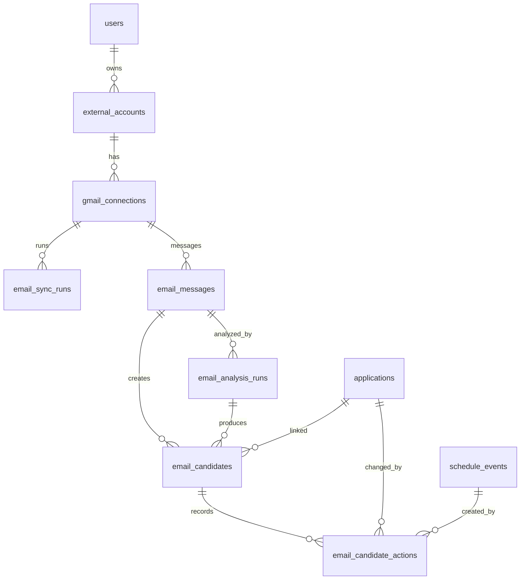
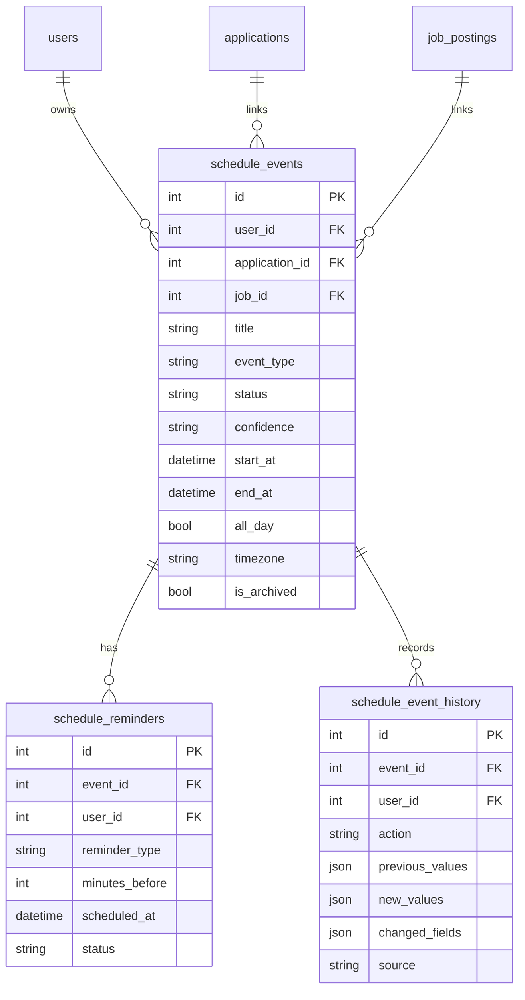
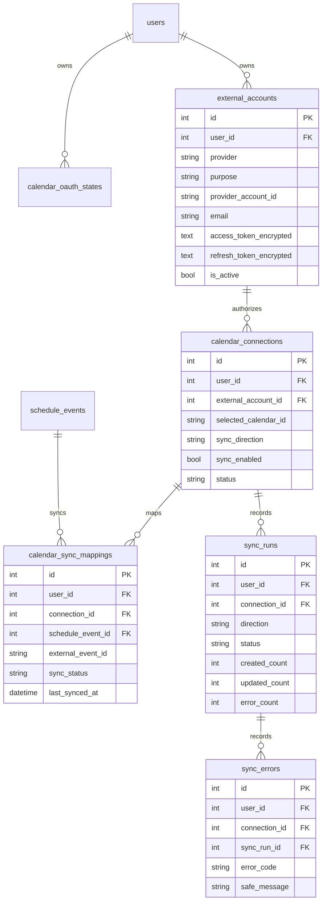

# ERD

## v0.8.0 Notification Operations ERD

## v0.7.0 Document Improvement ERD

## v0.6.1 Recommendation Automation ERD

## v0.6.0 Job Recommendations ERD

## v0.5.1 Gmail Analysis ERD

## v0.4.1 Schedule ERD

## v0.5.0 Calendar Integration ERD

