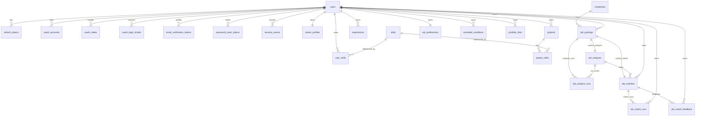

# ERD

현재 v0.2.2 기준 주요 관계를 Mermaid ERD로 표현한다.

## 관계 요약

- `users`는 대부분의 개인 데이터의 소유자이다.
- `companies`는 사용자 소유가 아니라 회사 master 성격이다.
- `job_postings`는 사용자 소유 데이터이며 `companies`를 참조한다.
- `job_analyses`는 공고별 현재 분석 결과 1개를 보장한다.
- `job_analysis_runs`는 분석 실행 이력이다.
- `job_matches`는 공고별 현재 적합도 결과 1개를 보장한다.
- `job_match_runs`는 적합도 분석 실행 이력이다.
- `job_match_feedback`은 적합도 결과에 대한 사용자 피드백이다.

## 삭제 정책 요약

- 사용자 삭제 시 사용자 소유 데이터는 cascade 삭제된다.
- 채용공고 삭제 시 해당 공고의 분석/적합도 결과는 cascade 삭제된다.
- 분석 실행 이력과 적합도 실행 이력은 현재 결과가 삭제되어도 가능한 범위에서 이력 보존을 고려한다.
