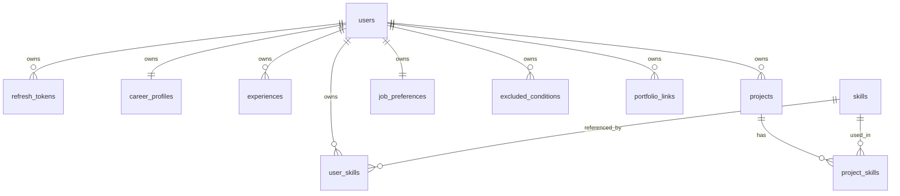

# ApplyMate AI ERD

## v0.1.2 관계 개요



## 테이블별 핵심 관계

### users

회원의 기준 테이블이다.

- `users.id`는 인증과 사용자 소유 데이터의 기준 PK다.
- 사용자 삭제 시 v0.1.2 커리어 프로필 관련 데이터는 cascade 삭제된다.

### refresh_tokens

- `refresh_tokens.user_id -> users.id`
- 사용자별 Refresh Token을 해시로 저장한다.
- 원문 토큰은 DB에 저장하지 않는다.

### career_profiles

- `career_profiles.user_id -> users.id`
- 사용자당 1개만 허용한다.
- unique: `user_id`

### skills

- 전역 기술 마스터다.
- unique: `normalized_name`
- 사용자별 소유 데이터가 아니므로 직접 `user_id`를 갖지 않는다.

### user_skills

- `user_skills.user_id -> users.id`
- `user_skills.skill_id -> skills.id`
- unique: `(user_id, skill_id)`
- 현재 사용자가 가진 기술과 숙련도를 표현한다.

### experiences

- `experiences.user_id -> users.id`
- 경력 레코드는 사용자에게 직접 귀속된다.

### projects

- `projects.user_id -> users.id`
- 프로젝트 레코드는 사용자에게 직접 귀속된다.

### project_skills

- `project_skills.project_id -> projects.id`
- `project_skills.skill_id -> skills.id`
- unique: `(project_id, skill_id)`
- 프로젝트 삭제 시 연결 레코드는 cascade 삭제된다.
- 기술 마스터 삭제는 제한한다.

### job_preferences

- `job_preferences.user_id -> users.id`
- 사용자당 1개만 허용한다.
- unique: `user_id`
- 희망 고용 형태, 지역, 기업 규모, 원격 선호, 희망 직무, 키워드를 저장한다.

### excluded_conditions

- `excluded_conditions.user_id -> users.id`
- unique: `(user_id, condition_type, value)`
- 지원하지 않을 조건을 사용자가 직접 관리한다.

### portfolio_links

- `portfolio_links.user_id -> users.id`
- unique: `(user_id, url)`
- GitHub, Notion, 블로그, LinkedIn 등 외부 링크를 저장한다.

## 삭제 정책

| 부모 | 자식 | 정책 |
| --- | --- | --- |
| users | refresh_tokens | CASCADE |
| users | career_profiles | CASCADE |
| users | user_skills | CASCADE |
| users | experiences | CASCADE |
| users | projects | CASCADE |
| users | job_preferences | CASCADE |
| users | excluded_conditions | CASCADE |
| users | portfolio_links | CASCADE |
| projects | project_skills | CASCADE |
| skills | user_skills | RESTRICT |
| skills | project_skills | RESTRICT |

## v0.1.2 migration

```text
backend/alembic/versions/20260718_1900_create_career_profile_tables.py
```

검증 순서:

```bash
cd backend
alembic upgrade head
alembic downgrade -1
alembic upgrade head
```
