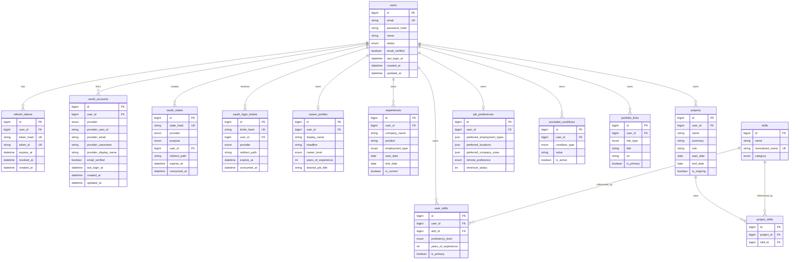

# ERD

v0.1.3 기준 핵심 관계입니다.

## OAuth unique constraints

- `oauth_accounts(provider, provider_user_id)`는 provider 계정의 전역 중복 연결을 방지합니다.
- `oauth_accounts(user_id, provider)`는 사용자당 provider 1개만 연결하도록 제한합니다.
- `oauth_states.state_hash`, `oauth_login_tickets.ticket_hash`는 1회용 값을 hash로만 저장합니다.
