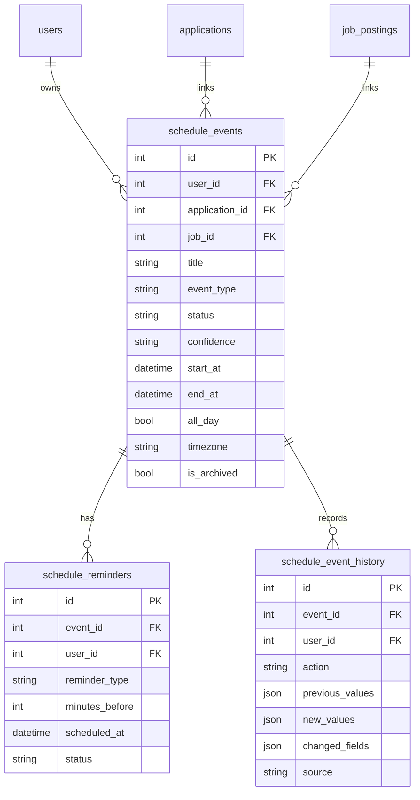
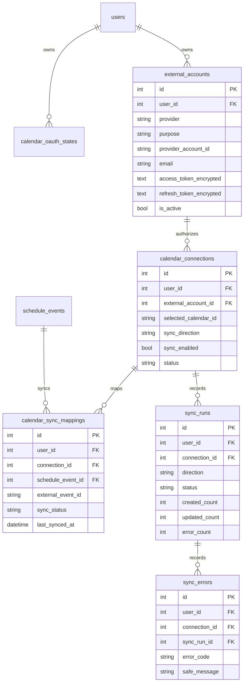

# ERD

## v0.4.1 Schedule ERD

```mermaid
erDiagram
    users ||--o{ schedule_events : owns
    applications ||--o{ schedule_events : links
    job_postings ||--o{ schedule_events : links
    schedule_events ||--o{ schedule_reminders : has
    schedule_events ||--o{ schedule_event_history : records

    schedule_events {
      int id PK
      int user_id FK
      int application_id FK
      int job_id FK
      string title
      string event_type
      string status
      string confidence
      datetime start_at
      datetime end_at
      bool all_day
      string timezone
      bool is_archived
    }

    schedule_reminders {
      int id PK
      int event_id FK
      int user_id FK
      string reminder_type
      int minutes_before
      datetime scheduled_at
      string status
    }

    schedule_event_history {
      int id PK
      int event_id FK
      int user_id FK
      string action
      json previous_values
      json new_values
      json changed_fields
      string source
    }
```

## v0.5.0 Calendar Integration ERD

```mermaid
erDiagram
    users ||--o{ calendar_oauth_states : owns
    users ||--o{ external_accounts : owns
    external_accounts ||--o{ calendar_connections : authorizes
    calendar_connections ||--o{ calendar_sync_mappings : maps
    schedule_events ||--o{ calendar_sync_mappings : syncs
    calendar_connections ||--o{ sync_runs : records
    sync_runs ||--o{ sync_errors : records

    external_accounts {
      int id PK
      int user_id FK
      string provider
      string purpose
      string provider_account_id
      string email
      text access_token_encrypted
      text refresh_token_encrypted
      bool is_active
    }

    calendar_connections {
      int id PK
      int user_id FK
      int external_account_id FK
      string selected_calendar_id
      string sync_direction
      bool sync_enabled
      string status
    }

    calendar_sync_mappings {
      int id PK
      int user_id FK
      int connection_id FK
      int schedule_event_id FK
      string external_event_id
      string sync_status
      datetime last_synced_at
    }

    sync_runs {
      int id PK
      int user_id FK
      int connection_id FK
      string direction
      string status
      int created_count
      int updated_count
      int error_count
    }

    sync_errors {
      int id PK
      int user_id FK
      int connection_id FK
      int sync_run_id FK
      string error_code
      string safe_message
    }
```
